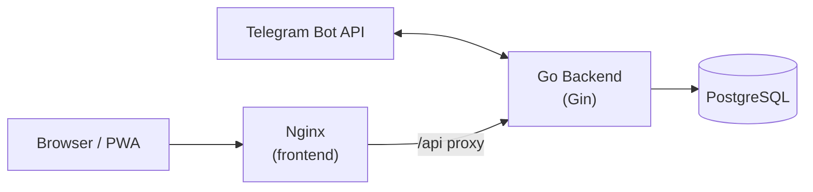

# Sprouty · 萌记

> Self-hosted bookkeeping that stays small, quick and yours.

一个可以自己部署的多账本记账应用，支持**项目预算**、**标签筛选统计**、**Telegram Bot 随手记账**、**深浅主题**、**PWA**。前后端分离，单条命令即可跑起来。

> 命名说明：对外品牌叫 **Sprouty**（萌记）；代码/数据库/容器里的 `sprouts*` 是项目内部代号（像 Twitter 内部叫 `birdhouse`），请勿混淆，也**不要手动改**这些标识，否则会破坏已部署实例。

---

## 截图

> 把截图放到 `docs/screenshots/` 下并在这里引用，例如：
>
> ```markdown
> 
> 
> ```

---

## 核心特性

- **多账本**：个人 / 家庭账本，通过邀请码共享；家庭账本可 **关联个人子账本**（成员与共享页管理），侧边栏以树形展示；仪表盘 **合并流水与月度总预算**（各账本的 `ledger_total` 相加），与合并支出对比剩余
- **系统管理**：管理员可开关公开注册、查看审计日志、**用户列表**（搜索、重置密码、启用/停用账号）
- **OIDC 登录**：可选对接 Google / Keycloak 等 OpenID Provider，与密码登录并存
- **项目 & 预算**：按项目聚合支出，支持一次性 / 月度预算；预算可指定 **统计用账本**（私账与家庭账分开核算时很实用）
- **分类与关键词**：自动归类（`午餐50` → 餐饮），可添加自定义关键词与优先级
- **标签体系**：可标记"报销"、"转账"等，在支出分析中一键排除
- **饼图分析**：按分类 / 项目 / 账本维度查看支出分布，支持年/月/全部时间；家庭账 + 多子账时与合并支出口径一致
- **Telegram Bot**：发一条消息 `午餐50 l:报销` 即完成记账
- **快速记账语法**：支持模糊输入、自然日期（昨天/前天/M月N号）、项目/账本跳转
- **深浅主题**：随系统自动切换，手动覆盖并持久化
- **响应式**：小屏幕自动收起侧栏，大屏幕可折叠
- **PWA**：可安装到桌面 / 手机主屏

## 技术栈

| 层 | 技术 |
|---|---|
| 前端 | React 19 · Vite · TypeScript · TailwindCSS v4 · Recharts · Lucide |
| 后端 | Go 1.23 · Gin · GORM · JWT · go-telegram-bot-api |
| 数据库 | PostgreSQL 15 |
| 反向代理 | Nginx |
| 容器编排 | Docker Compose |
| CI/CD | GitHub Actions → GHCR |

## 架构



---

## 快速部署

### 方式 A：使用 GHCR 预构建镜像（推荐）

只要服务器上有 Docker / Docker Compose 就能跑，不用 clone 整个仓库。

```bash
# 1. 下载生产 compose 与 env 模板
mkdir sprouty && cd sprouty
curl -fsSL https://raw.githubusercontent.com/ioeory/sprouty/main/docker-compose.prod.yml -o docker-compose.prod.yml
curl -fsSL https://raw.githubusercontent.com/ioeory/sprouty/main/.env.example           -o .env

# 2. 修改 .env（务必改 JWT_SECRET 与 DB_PASSWORD）
#    生成强随机 JWT：  openssl rand -hex 32
vi .env

# 3. 替换 compose 里的 OWNER/sprouty 为真实仓库路径，或通过环境变量覆盖
export BACKEND_IMAGE=ghcr.io/ioeory/sprouty-backend:latest
export FRONTEND_IMAGE=ghcr.io/ioeory/sprouty-frontend:latest

# 4. 启动（务必在含 .env 的目录执行，或显式指定）
docker compose -f docker-compose.prod.yml --env-file .env up -d

# 更新镜像后建议强制重建后端容器，避免仍跑旧 digest：
# docker compose -f docker-compose.prod.yml pull backend && \
#   docker compose -f docker-compose.prod.yml up -d --force-recreate backend

# 5. 打开浏览器
# http://localhost:4000
```

**锁定版本**（建议生产环境锁到具体 tag，例如 `v1.0.0`）：

```bash
BACKEND_IMAGE=ghcr.io/you/sprouty-backend:v1.0.0 \
FRONTEND_IMAGE=ghcr.io/you/sprouty-frontend:v1.0.0 \
docker compose -f docker-compose.prod.yml up -d
```

### 方式 B：从源码本地构建

适合本地开发或需要自定义构建参数：

```bash
git clone https://github.com/ioeory/sprouty.git
cd sprouty
cp .env.example .env         # 修改 JWT_SECRET、DB_PASSWORD 等
docker compose up -d --build
```

访问 `http://localhost:4000`，第一次进入点右上注册账号即可。

---

## 环境变量

全部在 `.env` 里配置。参考 `.env.example`。

| 变量 | 必填 | 默认 | 说明 |
|---|---|---|---|
| `DB_HOST` | 否 | `db` | Postgres 主机，Docker 内用 `db` |
| `DB_PORT` | 否 | `5432` | Postgres 端口 |
| `DB_USER` | 否 | `sprouts` | Postgres 用户名 |
| `DB_PASSWORD` | **是** | `sprouts123` | **生产务必改**，弱密码会被扫 |
| `DB_NAME` | 否 | `sprouts_db` | 数据库名 |
| `PORT` | 否 | `8080` | 后端监听端口 |
| `JWT_SECRET` | **是** | — | JWT 签名密钥；`openssl rand -hex 32` 生成 |
| `BOOTSTRAP_ADMIN_USERNAME` | 否 | 空 | **一次性修复用**：库里已有用户但没有任何 `admin` 时，后端启动时把该用户名的账号提升为管理员；生效后可删 |
| `TELEGRAM_BOT_TOKEN` | 否 | 空 | 不填则 Bot 功能禁用 |
| `TELEGRAM_BOT_USERNAME` | 否 | 空 | Bot 用户名（不含 `@`），供前端生成绑定深链接 |
| `BOT_PROXY` | 否 | 空 | 访问 `api.telegram.org` 的代理，例如 `http://host.docker.internal:7890` |
| `BACKEND_PORT` | 否 | `8080` | 宿主机映射端口（仅 prod compose） |
| `FRONTEND_PORT` | 否 | `4000` | 宿主机映射端口（仅 prod compose） |
| `FRONTEND_BASE_URL` | OIDC 时建议设 | `http://localhost:4000` | OIDC 回调成功后浏览器重定向的前端根地址 |
| `OIDC_ISSUER` | OIDC 时必填 | 空 | IdP Issuer URL（如 Keycloak realm、Google） |
| `OIDC_CLIENT_ID` / `OIDC_CLIENT_SECRET` | OIDC 时必填 | 空 | 在 IdP 注册的机密客户端 |
| `OIDC_REDIRECT_URI` | OIDC 时必填 | 空 | 须与 IdP 完全一致，形如 `https://你的域名/api/auth/oidc/callback` |
| `OIDC_SCOPES` | 否 | 代码默认 `openid profile email` | 空格分隔 |

**账号与权限**：

- 第一个成功注册的用户自动成为 **管理员**，并 **关闭公开注册**。
- 管理员可在 **系统管理** 中：开关公开注册、查看审计日志、**管理用户**（创建用户、重置密码、启用/停用；不能禁用自己）。
- 若早期数据里 **没有任何管理员**（例如旧版本无角色字段），可临时设置 `BOOTSTRAP_ADMIN_USERNAME=你的用户名` 并重启后端一次；或确保库里至少有一名 `role=admin` 的用户。
- 仅密码用户可用用户名密码登录；纯 OIDC 用户需走 OIDC 入口。

---

## 使用指南

### 1. 注册与账本

首次访问 `http://localhost:4000` → 点「注册」→ 登录后自动创建默认账本（首个用户为管理员，随后默认关闭公开注册）。点左上账本名可切换 / 新建 / 加入账本；**账本所有者**可在标题栏铅笔图标处 **重命名账本**。

**家庭账本与个人子账本**（成员与共享）：

- 当前账本为 **家庭** 时，可将 **你名下的个人账本** 关联为子账（每人只能把同一私账挂到一个家庭）。
- **侧边栏**：家庭账本下会列出已关联的「子账 · xxx」，点击即可切换；已挂靠家庭的个人账不会与家庭账重复出现在顶层列表。
- **仪表盘 / 流水记录**：选中家庭账且存在可访问的子账关联时，**支出、饼图、最近流水与流水列表**均合并「家庭 + 这些子账」；列表中会标注来源账本名称。**本月总预算**为上述各账本在「月度总预算」（`ledger_total`）上的 **金额相加**（某本未设则为 0），与合并后的支出一起算剩余与日均可花。若仅需家庭账本本身流水（不含子账），可调用 API：`GET /api/transactions?ledger_id=<家庭id>&strict_ledger=1`。

**非 HTTPS / 局域网访问**：浏览器可能不提供剪贴板 API，复制邀请码等操作会自动降级；若失败请手动选中复制。

### 2. 分类、标签、项目

- **分类**：在 `设置 → 分类` 里增删，为每个分类添加关键词（例如把 `饭 / 午餐 / 晚饭` 都归到"餐饮"）
- **标签**：在 `设置 → 分类 → 标签` 卡片创建，可设置颜色和"默认排除统计"
- **项目**：在 `项目` 页新建，可单独设预算（一次性 / 月度）；编辑预算时可选择 **预算统计账本**（只把该账本下、带本项目的支出计入预算进度）

### 3. 记账

点右上角 `+` 或键盘 `N`：金额、分类、（可选）项目、（可选）多选标签，回车保存。

### 4. Telegram Bot 绑定

1. 在 `设置 → Telegram` 点"生成绑定码"
2. 在 Telegram 找到你的 Bot，发送 `/start <绑定码>`
3. 收到"绑定成功"后，直接发消息就能记账

### 5. 快速记账语法

Bot 和前端都支持这些语法：

```
午餐 50                   → 金额 50，归入"餐饮"
500 衣服                  → 金额 500，归入"购物"
昨天打车 30               → 日期 = 昨天，归入"交通"
3月15号 超市200            → 指定日期
午餐50 (和同事)            → 括号里的内容写入备注
打车30 @家庭               → 切换到账本名含"家庭"的账本
报销100 l:报销            → 附加"报销"标签（可在统计里排除）
200 工资 收入              → 识别为收入
```

- 标签语法：`l:<名字>` 或 `标签:<名字>`，多个可重复
- 账本语法：`@<账本关键词>`，通过 `设置 → 账本关键词` 维护
- 不识别的字眼会进入备注

---

## 开发指南

### 本地运行后端

```bash
cd backend
cp ../.env.example .env   # 或者直接 export 环境变量
go run ./cmd/main.go
# 后端跑在 :8080
```

### 本地运行前端

```bash
cd frontend
npm install
npm run dev
# 开发服务器跑在 :5173，Vite 会把 /api 代理到 :8080
```

### 测试

```bash
cd backend
go test ./...
```

### 目录结构

```
.
├── backend/                    Go 服务
│   ├── cmd/main.go             入口
│   └── internal/
│       ├── api/                HTTP handlers + middleware（含家庭子账关联、仪表盘汇总等）
│       ├── bot/                Telegram Bot（含 parser）
│       ├── models/             GORM 模型
│       └── service/            DB 连接 / 迁移
├── frontend/                   React 19 + Vite
│   ├── src/
│   │   ├── api/                axios client
│   │   ├── components/         通用组件
│   │   ├── pages/              Dashboard / Transactions / Categories / ...
│   │   └── contexts/           Theme / Auth / Layout
│   └── nginx.conf              生产镜像用
├── docker-compose.yml          开发：从源码 build
├── docker-compose.prod.yml     生产：从 GHCR 拉镜像
├── .env.example                环境变量模板
└── .github/workflows/
    └── docker-publish.yml      CI：构建多架构镜像推 GHCR
```

---

## CI/CD：GitHub Actions → GHCR

仓库自带的 [.github/workflows/docker-publish.yml](.github/workflows/docker-publish.yml) 会自动构建并推送镜像：

| 事件 | 推送的 Tag |
|---|---|
| Push 到 `main` | `latest` + `sha-<短哈希>` |
| Push tag `v1.2.3` | `1.2.3`、`1.2`、`1`、`latest`（语义化） |
| Push tag `beta-*` | 预发布标签，同样推镜像 |
| 仅改 `README.md` | 不触发构建（`paths-ignore`） |
| Pull Request | 仅构建验证，不推送 |

- 平台：`linux/amd64` + `linux/arm64`
- 缓存：GitHub Actions cache（二次构建显著提速）
- 镜像路径：`ghcr.io/<owner>/<repo>-backend`、`ghcr.io/<owner>/<repo>-frontend`（仓库叫 `sprouty` 时就是 `ghcr.io/<owner>/sprouty-backend`）

### 首次启用

1. Push 到 GitHub，等待 Actions 跑完（Actions 标签页查看）
2. 仓库主页右栏 → Packages → 会看到两个包，默认 **private**
3. 若要公开分发：进入包 → Package settings → Change visibility → Public
4. 拉取 private 镜像需登录：
   ```bash
   echo $GITHUB_PAT | docker login ghcr.io -u <your-user> --password-stdin
   ```
   （`GITHUB_PAT` 需在 GitHub → Settings → Developer settings → Personal access tokens 创建，勾选 `read:packages`）

### 发布新版本

```bash
git tag v1.0.0
git push origin v1.0.0
```

Actions 自动构建并发布带语义化版本号的多架构镜像。

---

## 安全注意事项

- `.env` **永远不要提交**（已在 `.gitignore` 里）
- `JWT_SECRET` 务必用 `openssl rand -hex 32` 生成，不要用默认值
- `DB_PASSWORD` 务必改掉
- 如果 Telegram Token 泄露过，立即到 [@BotFather](https://t.me/BotFather) 执行 `/revoke` 重新生成
- 镜像以非 root 用户 `app` 运行（Dockerfile 中的 `USER app`）

---

## Roadmap

- [ ] 导入 / 导出（CSV、微信账单）
- [ ] 预算超支邮件通知
- [ ] 多币种
- [ ] 更多快速记账语法（经常性账单）
- [ ] 子账关联后的跨账报表/导出细化

---

## License

MIT
